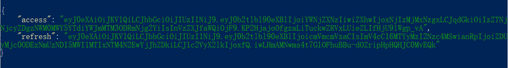
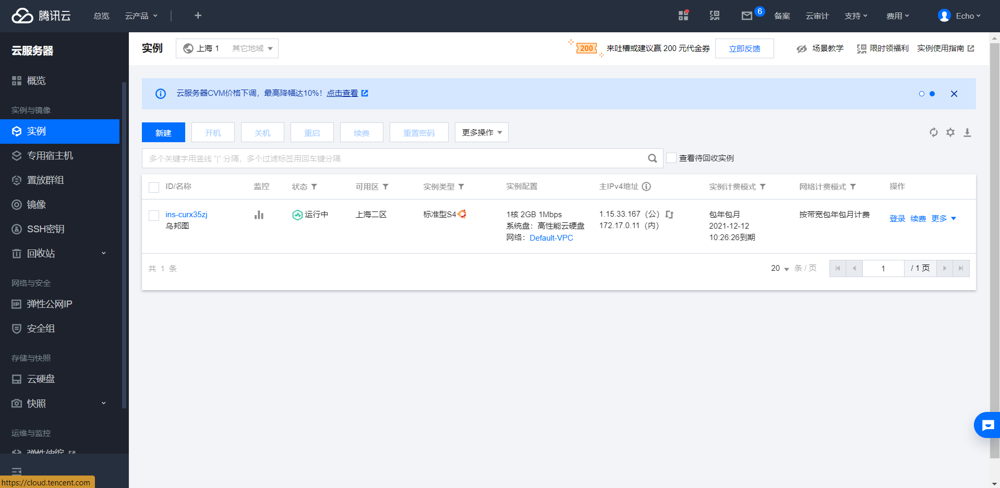
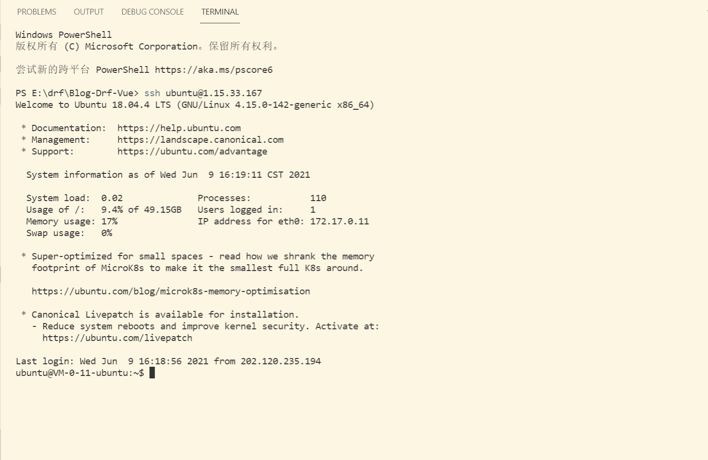
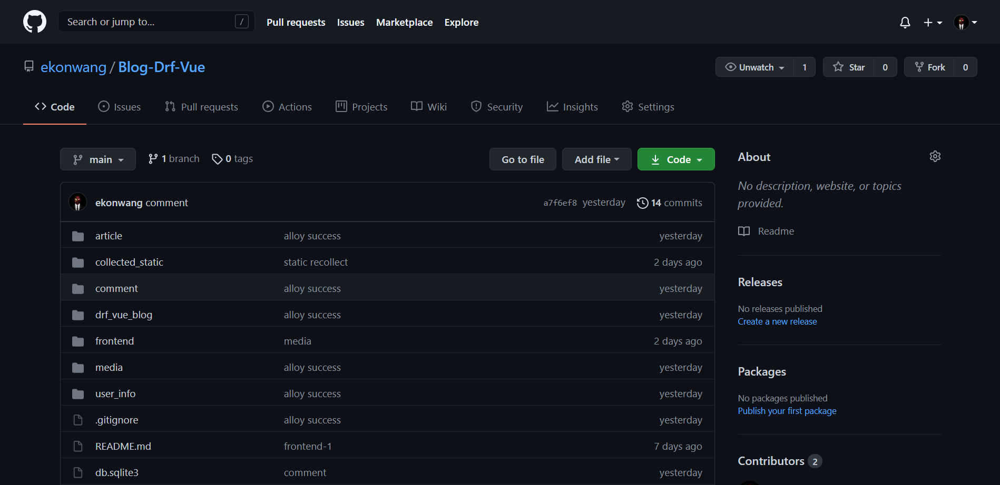
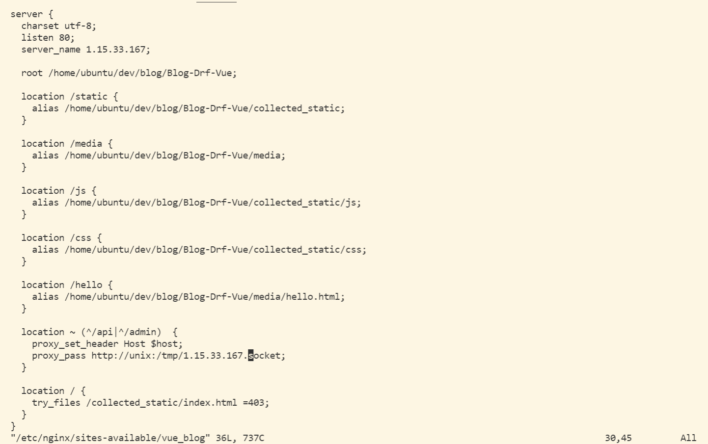

# <center>数据库项目报告</center>

# 项目综述背景

一名良好的全栈工程师应当在掌握后端算法技能的同时，掌握一些前端知识，搭建公共博客涉及前端框架的使用、后端代码的编写、以及用户管理、文章管理等诸多细节，同时也使用到了数据库知识，以实现数据的持久化。

本项目实现了一个网络博客，并上线公网。前端使用vue.js框架，以实现高效渲染，后端使用django + rest_framework框架，实现高性能的请求处理。项目名称为Yifou blog，公网的访问IP为 1.15.33.167。主要功能包括：文章管理(文章发布、文章编辑)、标签管理(标签创造)、分类管理、用户信息管理(用户信息编辑、注册、登录、登出、注销)、文章标题图（图片上传、标题图编辑）、用户令牌（这个feature出于安全性引入）、评论功能（发表一般评论、多级评论）、公网访问（使用nginx负载均衡器部署）

# 开发环境

`开发环境：Windows 10 (python 3.9.1,	Node.js v14.17.0,`

`Django 3.1.3, 	npm 6.14.13)`

`部署环境：Linux/ubuntu20.04 (python3 3.8.10,	 Node.js v14.17.0,	`

`Django 3.1.3, 	npm 7.16.0)`

# 数据库设计

项目ER图如图所示，这些表以model的对象，在Django框架中定义了，并通过Django的数据迁移操作实际落地：


# 后端系统设计

## article APP

### Category模块

为了搭建article模块，先声明Category类：

```python
'''article/models.py'''

from django.db import models

class Category(models.Model):
    """ 文章分类 """
    title = models.CharField(max_length=100)
    created = models.DateTimeField(default=timezone.now)

    class Meta:
        ordering=['-created']
    def __str__(self):
        return self.title
```

在Django中，每个声明的model对应着一个数据表，model的名称正好对应数据表的表名，而其中声明的各个字段，则对应着数据表的各个Column。

首先，Python框架提供了一个基类Model，在此声明的Category也是继承它而来。其二：子类Meta中的ordering字段，表明数据的排列顺序，在这里我们选择按创建时间逆序返回Category数据。其三：该类定义的`__str__`方法定义了在管理站点各个Category对象的显示内容，这里就选择显示Category的直接内容title。

接着就需要定义Category的序列化器serializer：

```python
'''article/serializers.py'''

from rest_framework import serializers
from article.models import Article

class CategorySerializer(serializers.ModelSerializer):
    """分类的序列化器"""
    url = serializers.HyperlinkedIdentityField(view_name='category-detail')

    class Meta:
        model = Category
        fields = '__all__'
        read_only_fields = ['created']
       
    
class CategoryDetailSerializer(serializers.ModelSerializer):
    """分类详情"""
    articles = ArticleCategoryDetailSerializer(many=True, read_only=True)

    class Meta:
        model = Category
        fields = [
            'id',
            'title',
            'created',
            'articles',
        ]
```

为什么要定义serializer? 因为这个项目中，前后端采用的是端口间json文本通信（至少在测试阶段是这样）。json 文件正是为此目的而创造的，它提供了一种通用的通信格式，采用类似key-value的形式储存数据。数据在后端传入前端需要转换成json文件，这个过程就称作**序列化**，而它的逆过程，就称为**逆序列化**。

这里的代码首先，声明两种serializer是为了满足不同场景的需要，一些场景下需要显示Category对象及其关联的文章（比如在显示文章列表时），为此就定义了 CategoryDetailSerializer ，而另一些场景中只需要所有category列表，其关联信息可以不显示（比如在编辑文章时，在旁边提供的供选择的category），为此就定义了 CategorySerializer。其二，Meta子类中fields中表明将会序列化哪些字段，model字段则表明序列化的类名。其三，为了保障安全性，可以在序列化器中声明一个read_only_fields，并加入仅可读的字段列表，表明serializer将不会接受对该字段的修改。

最后定义视图类：

```python
class CategoryViewSet(viewsets.ModelViewSet):
    queryset = Category.objects.all()
    serializer_class = CategorySerializer
    permission_classes = [IsAdminUserOrReadOnly]
    pagination_class = None

    def get_serializer_class(self):
        if self.action == 'list':
            return CategorySerializer
        else:
            return CategoryDetailSerializer 
```

这里的代码有几点需要注意：首先，`get_serializer_class()`方法提供了根据不同需求选择不同`serializer`的手段；其二，`permission_classes` 提供了权限声明，即只有管理员和自己才能编辑Category对象；其三，`pagination_class = None` 表明序列化器返回的数据不会分页，这点和 `article` 不一样；`queryset`表明数据取用的对象，该类中对象是Category类的对象全体。

### Tag 模块 & Avatar 模块

model定义：

```python
class Tag(models.Model):
    """ 文章标签 """
    text = models.CharField(max_length=30)

    class Meta:
        ordering = ['-id']
    def __str__(self):
        return self.text
    
class Avatar(models.Model):
    content = models.ImageField(upload_to='avatar/%Y%m%d')
```

这里需要注意的是：`Avatar` 类中的 `content` 字段声明了图片上传路径为 `'avatar/%Y%m%d'`。

序列化器定义：

```python
class TagSerializer(serializers.HyperlinkedModelSerializer):
    """标签序列化器"""

    def check_tag_obj_exists(self, validated_data):
        text = validated_data.get('text')
        if Tag.objects.filter(text=text).exists():
            raise serializers.ValidationError('Tag with text {} exists.'.format(text))

    def create(self, validated_data):
        self.check_tag_obj_exists(validated_data)
        return super().create(validated_data)

    def update(self, instance, validated_data):
        self.check_tag_obj_exists(validated_data)
        return super().update(instance, validated_data)

    class Meta:
        model = Tag
        fields = '__all__'
        
class AvatarSerializer(serializers.ModelSerializer):
    url = serializers.HyperlinkedIdentityField(view_name='avatar-detail')

    class Meta:
        model = Avatar
        fields = '__all__'
```

视图集定义：

```python
class TagViewSet(viewsets.ModelViewSet):
    queryset = Tag.objects.all()
    serializer_class = TagSerializer
    permission_classes = [IsAdminUserOrReadOnly]
    pagination_class = None
    
class AvatarViewSet(viewsets.ModelViewSet):
    queryset = Avatar.objects.all()
    serializer_class = AvatarSerializer
    permission_classes = [IsOwnerOrAdminOrReadOnly]
    pagination_class = None
```

### Article模块


## comment APP


## user_info APP


# 前端系统设计


# 核心Features

## 后台管理系统

有两种方式管理后台：

第一种方式是在服务器打开django服务器：在项目主目录下运行 `python3 manage.py runserver`，此时后台项目就运行在localhost的8000（默认）端口了，接着以管理员身份向localhost发送POST、PATCH、DELETE请求，就可以实现对任意文章、用户的信息进行增删改查，也可以新建对象。这种方式功能强大，但缺点是没有图形化界面。

第二种方式是打开根域名下的admin子域( 1.15.33.167/admin/ )：这是django框架自带的后台管理系统，提供了优美简洁的图形化界面，以实现用户管理，但实际功能有限，只能对用户进行操作。原因在于models中定义的视图集是rest_framework中的viewsets的继承子类，其接口与django本身并不兼容。因此对于文章、分类、标签、avatar的管理只能通过命令行界面实现。


## Token

Web程序使用HTTP协议传输data，而HTTP协议是无状态的协议，对于事务没有记忆能力。也就是说，如果没有其他形式的帮助，服务器是没有办法知道前后两次请求是否由同一名用户发起的，也就无法对用户身份验证。

传统Web开发中，身份验证主要是基于session会话机制进行的，session对象储存会话中的用户信息，并不随用户的页面跳转而消失，而是伴随整个会话进程中持续存在。但是当会话较多时，维护session将给服务器带来压力。

比较常见的方式是JWT(Json Web Token)验证，JWT是一套通用的标准，保障安全的传输。由于Token是储存在客户端的，所以不会对服务器造成很大的压力。

比如我们可以在后台管理系统申请一个token，结果返回就是这样：



如图所示，token就是一串很长的字符，用户拿到token就像拿到自己的令牌，可以在权限范围内请求、编辑数据。

## vue框架的使用

传统的Web开发前后端高度耦合，不便于维护，一旦出现问题前端和后端都返工。尤其对于大型项目，采用这种开发模式无疑提高了沟通成本，降低效率。

**Vue框架**是一个组件化的前端框架，引进Vue将实现一个重要的概念：**“前后端分离”**。在该模式下，前端与后端将通过有限的API关联，实现信息传递。这种方式下，前端工程师和后端工程师只需要约定几个API接口，并行开发互不影响，只要API需求不发生变更，即便一方需要修改代码，另一边也无需相应修改。


**vue框架**同样具有高效的渲染能力，在相同代码量下，经过实测认为vue的确在渲染方面更为出众，这也是项目最终采用Django + Vue 开发的原因所在。项目的最终渲染效果如图(也可[ctrl + click 1.15.33.167](http://1.15.33.167/)直接访问)：


## 云服务器部署

为了项目最终的完成度，最终选择将项目部署到云服务器上，实现公网访问。这也是这次项目最具成就感的一步; )

首先在腾讯云服务器上用教育优惠购买一个最低配的1核2G服务器(十分卑微)：



SSH连接服务器 `ssh user@<ip>`：

SSH是secure shell的简称，一种非对称加密来实现安全传输的加密协议，目前SSH最为常见的用途就是远程登录系统。



接着在本地(windows)将代码上传到github.com，这个过程将中间文件加入.ignore文件，保证代码的纯净。

这一步主要是为了将项目整体迁移到服务器上，应该算走了弯路。更直接的做法是通过ssh协议(scp)直接传输文件夹，但上传github.com本身也是为了更好的版本控制，以及分享，所以问题不大。



之后在服务器端直接找一个喜欢的文件夹，使用 `git clone git@<server>:<repository>`克隆库到服务器，但此时还剩下最后一个步: **nginx**

## nginx 模块

项目迁移之后是不是 `npm serve run` 加上 `python3 manage.py runserver` 就完事了？我当时就这么naive，然而这样做缺少了proxy 作为转发代理的 server，无论尝试多少次访问服务器公网 ip 任何端口都不会有任何结果。

nginx的官方描述是这样的：

> nginx [engine x] is an HTTP and reverse proxy server, a mail proxy server, and a generic TCP/UDP proxy server, originally written by [Igor Sysoev](http://sysoev.ru/en/). For a long time, it has been running on many heavily loaded Russian sites including [Yandex](http://www.yandex.ru/), [Mail.Ru](http://mail.ru/), [VK](http://vk.com/), and [Rambler](http://www.rambler.ru/). According to Netcraft, nginx served or proxied [22.87% busiest sites in May 2021](https://news.netcraft.com/archives/2021/05/31/may-2021-web-server-survey.html). Here are some of the success stories: [Dropbox](https://blogs.dropbox.com/tech/2017/09/optimizing-web-servers-for-high-throughput-and-low-latency/), [Netflix](https://openconnect.netflix.com/en/software/), [Wordpress.com](https://www.nginx.com/case-studies/nginx-wordpress-com/), [FastMail.FM](http://blog.fastmail.fm/2007/01/04/webimappop-frontend-proxies-changed-to-nginx/).

可见nignx十分强大，它在这次项目中不仅能够作为proxy承担代理的作用，更能作为负载均衡器，提升网站性能。

首先apt-get下载nginx，之后在/etc/nginx/sites-avalible增加一个配置文件vue_blog ，当然也可以另外取名:



大意是对来自网络的请求解析，并请求不同资源返回到client，比如请求静态资源时就转发到collected_static文件，请求动态资源就转发到默认的index.html，这个过程很好地完成了对请求的分流。

当然本人在配置nginx过程中犯下了一个困扰长达两天的问题，这个问题使得本人在配置nginx后依然面临404页面，之后查询nginx错误日志  `/var/log/nginx/error.log`  才最终定位到问题所在。

运行 `tail -f /var/log/nginx/error.log` 发现每次nginx的请求都被403 permission deny 13 了，经过一番查证认为是nginx配置不当缺乏权限造成的。之后改变 `vim /etc/nginx/nginx.conf` 中的user 为 root，就成功解决了。

之后运行最后两步:

`service nginx start`

`gunicorn --bind unix:/tmp/1.15.33.167.socket my_blog.wsgi:application` 

前一步是启用nginx服务，而后一步是将gunicorn绑定到后端Django框架代码中，至此就大！功！告！成！啦！已经可以正常访问公网IP并显示预期中的页面。

# 文档说明

本项目文件架构如图所示，通过tree指令生成文件树 ：

Blog-Drf-Vue
├── article
│   ├── admin.py
│   ├── apps.py
│   ├── failed_serializers.py
│   ├── __init__.py
│   ├── migrations
│   ├── models.py
│   ├── permissions.py
│   ├── serializers.py
│   ├── tests.py
│   ├── urls.py
│   └── views.py
├── collected_static
│   ├── admin
│   ├── css
│   ├── favicon.ico
│   ├── index.html
│   ├── js
│   └── rest_framework
├── comment
│   ├── admin.py
│   ├── apps.py
│   ├── __init__.py
│   ├── migrations
│   ├── models.py
│   ├── permissions.py
│   ├── serializers.py
│   ├── tests.py
│   └── views.py
├── db.sqlite3
├── drf_vue_blog
│   ├── asgi.py
│   ├── __init__.py
│   ├── settings.py
│   ├── urls.py
│   └── wsgi.py
├── frontend
│   ├── babel.config.js
│   ├── dist
│   ├── node_modules
│   ├── package.json
│   ├── package-lock.json
│   ├── public
│   ├── README.md
│   ├── src
│   └── vue.config.js
├── manage.py
├── media
│   └── avatar
├── README.md
├── requirements.txt
└── user_info
    ├── admin.py
    ├── apps.py
    ├── __init__.py
    ├── migrations
    ├── models.py
    ├── permissions.py
    ├── __pycache__
    ├── serializers.py
    ├── tests.py
    └── views.py

解读一下各个一级文件/文件夹的作用：

frontend文件夹是前端文件夹，通过vue-cli的初始化生成，其中src是编辑对象文件，包含了渲染所需的源文件。dist是开发完毕后搜集的静态文件，其他文件夹包含了vue框架中必须的组件。

article是article APP对应的文件夹，实现文章管理。主要的文件是models.py、serializers.py、views.py，其余为框架生成的相应必须文件。models.py 定义了项目中用到的模型，包括Article，Category，Tag，以及 Avatar; serializers.py 定义了序列化各个模型的方法；views.py 则定义了视图集。此外同级user_info、comment分别实现用户管理以及评论管理，内部架构与article相同，这里就不再赘述。

media文件夹用来存放图片等媒体资源。

collected_static是项目搜集的全部静态资源，该文件夹下有index.html。

drf_vue_blog与项目文件夹名一致，是django框架的核心文件夹，包含setting.py（配置文件），urls.py（路由文件）。

db.sqlite3是数据库文件，项目数据储存在该文件中，包含用户数据、文章数据、评论、标签等所有可编辑的数据。

readme.md是说明文件，requirements.py 在部署时很有用，它记录了项目所有用到的库。

# 实验总结


